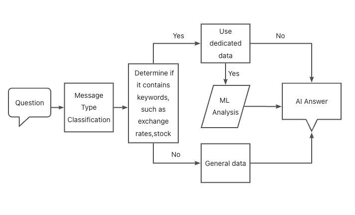

# WechatBot (TubeX+Gemini Version)


<div align="center">
    
</div>

这是一个基于Gemini大语言模型开源的微信机器人AI智能体，可以识别微信小程序、转账、文本聊天、语音聊天、图片，并做出及时反应。同时，它集成了中国实时经济新闻、数字货币信息。用户只需配置自己的api key即可使用。

This is an open-source WeChat robot project based on WechatY, Gemini, and Microsoft Azure ASR voice services. After users fill in the Dify API information and Microsoft ASR KEY in the configuration file, they can quickly deploy their own AI robot.

|function|功能|progress|
|--|--|--|
|AI chat by any LLM| 任意大模型AI聊天|✅|
|WeChat chat voice recognition |微信聊天语音识别|✅|
|AI reads and understands files, supporting formats XSL, DOCS, PDF, TXT |AI阅读并理解文件，支持格式XSL、DOCS、PDF、TXT|✅|
|AI understands non-text data such as transfers, red envelopes, and geographical locations. |AI理解转账、红包、地理位置等非文本数据|✅|
|WeChat room chat management |微信群聊天管理|✅|
|Regular message push in WeChat group |微信群定时消息推送|✅|
|Third-party knowledge base access |第三方长期记忆接入|✅|
|Email notification to Administrator |管理员邮件通知|✅|
| Long Memeory for chat | 聊天长记忆 |✅|
| Self-running business | 自我运维 |✅|
| Crypto Coin Market Analysis | 数字货币市场分析 |✅|
| Chinese Financial Market Analysis | 中国金融市场数据获取及分析 |✅|
| USNG | 天然气CFD |✅|
| UKOIL | 布伦特原油 |✅|
| USGC | 纽约黄金价格 |✅|
| Inpainting | 机器人集群启动 |✅|
| Websocket监听通信 | Websocket监听通信 |✅|
| SQLite | 支持SQLite数据库 |✅|
| Group Chat Export | 群聊天记录的导出 |✅|


## Workflow

<div align="center">
    
</div>

## Dependencies Install

```bash
# e.g. Ubuntu 22
sudo apt update
# 启动语音识别功能需要安装ffmpeg
sudo apt install ffmpeg
# redis记录临时ID
sudo apt install redis-server
npm install -g pm2
```

## 部署前环境变量配置

初始账号：admin
初始密码：123456


## Quick Started

```bash
npm install
# Development
node index.js
# Production
pm2 start index.js -n tubex-wechatbot
# open logs and scan login QRcode
pm2 logs tubex-wechatbot
```
### Wechat Room for users


### 微信风控提示

本机器人在登录账号实名认证后自身不会出现微信风控的问题，但是在群聊过程中高频率出现股票投资、比特币投资等话题情况下会导致群聊、朋友圈等功能被封一个月的情况。使用者请注意管控好机器人的言行。

### 数字货币功能的部署与使用

本机器人接入的数字货币信息均来源于币安实时信息，但是由于Binance API在中国境内无法访问，在部署服务器上请选择海外服务器。
在涉及数字货币的问题上，用户应该携带关键词如：数字货币、加密货币、趋势、走势等。目前仅支持当日币安最热门的5个币种的趋势分析。
由于市场分析的难度较大，建议开发者使用GPT-4o、Gemini 1.5、Gemini flash等海外大模型。
本机器人未来会接入StochRSI技术数据，以1小时线为基础向用户推送。对于普通用户来说，我们不建议您参与数字货币的投机。

### 数字货币数据标注

当符合如下条件之一，该数字货币将会被标注为空

1. MACD快慢线数值均低于正数数据1/2之下且MACD值为负数
2. 涨幅超过30%且当日交易额低于1亿；

当符合如下条件之一，该数字货币将会被标注为多：

1. MACD快慢线数值均低于正数数据1/2之上；
2. 当日交易额高于10亿；

### Cooperation

lewis.q.zhang@gmail.com

https://tubex.chat


