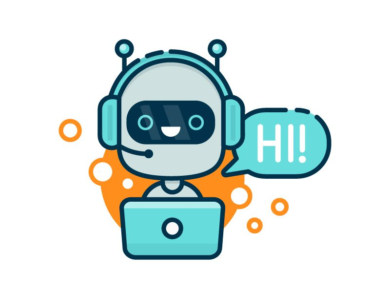

# WechatBot (TubeX)


<center>

</center>

这是一款基于WechatY、Dify API服务、微软Azure ASR语音服务微信机器人开源项目。用户在配置文件中填入Dify API信息、微软ASR KEY之后，
用户可以快速部署自己的AI机器人。

1. AI聊天；✅
2. 语音识别；✅
3. 阅读并理解文件，支持格式XSL、DOCS、PDF、TXT ✅
4. 理解转账、红包、地理位置等非文本数据 ✅
5. 微信群聊天管理；✅
6. 微信群定时消息推送；✅
7. 第三方知识库接入；✅
8. 管理员邮件通知；✅

## Quick Started

```bash
npm install
# Production
node index.js
# Development
pm2 start index.js
```

## Configuration


### 语音识别及合成服务

本项目的语音识别及合成服务对接[Azure语音服务](https://azure.microsoft.com/zh-cn/free/ai-services/)。开发者需要申请API KEY。
